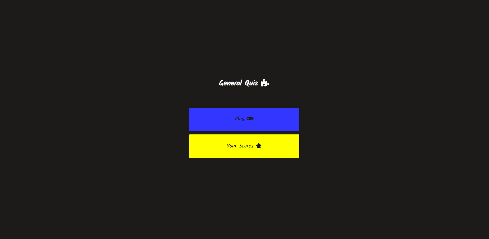
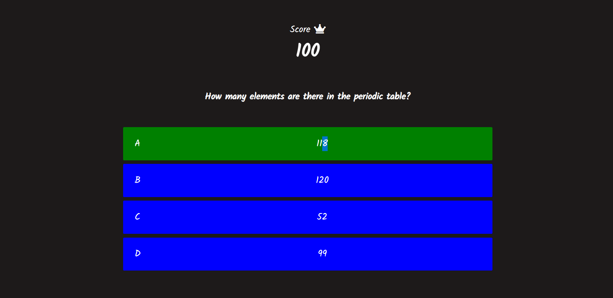
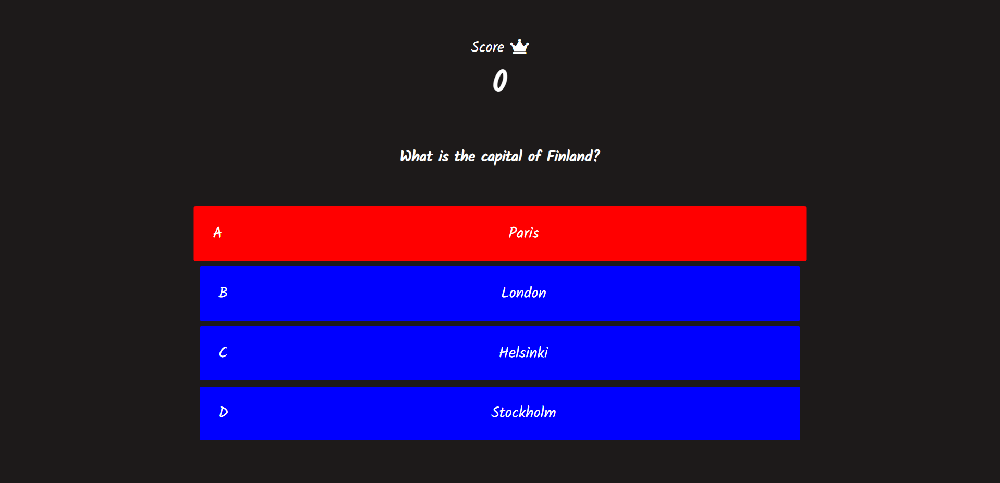
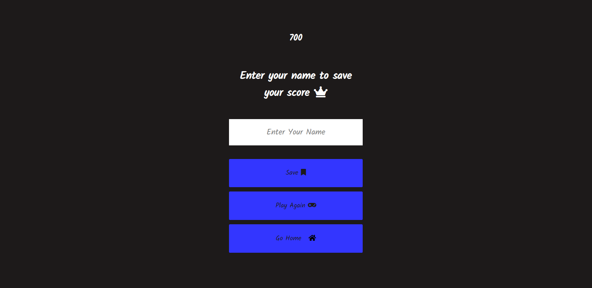
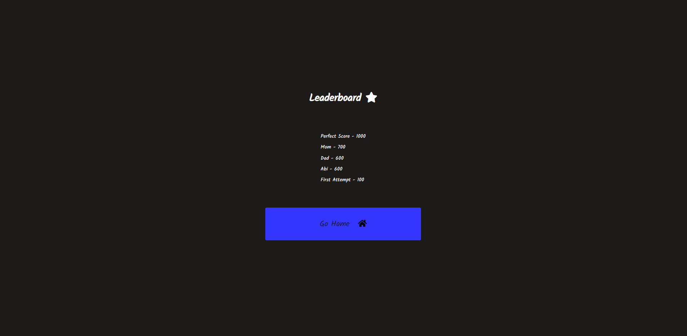
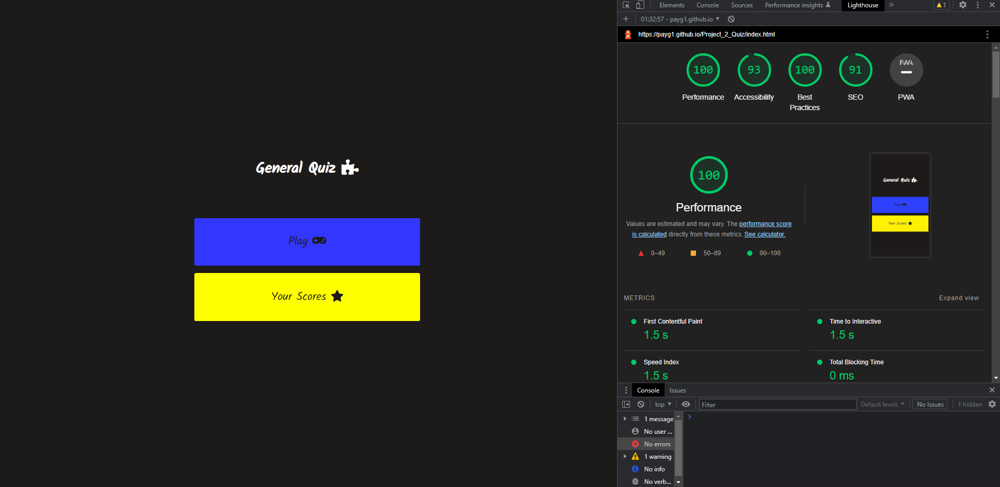

# Project_2_Quiz

This Quiz will test your knowuladge regarding different subjects and topics ranging from Geography,Chemistry Phisics and TV/Movies.

## Features

  -Navigation
   - Navegation Buttons in the mnu that will let you start the game and view you scores.
   
   
  
  
  - Visual feedback when you get your answers right(green) and wrong(red).
  
   
   
   
   - Point system, when you get and answer correctly you get 100 points, up to 1000.
   
   
   
  - Ability to input your name at the end of the game to save your score.
  
  
  
  - Ability to have 5 of the highest scores saved.
  
  
  
## Testing
  - I confirmed that the website runs in Chrome, Firefox, Safari, and Opera.
  
  - I have tested that the website is responsive and adjusts to different screen sizes.
  
  - All grammatical errors have been corrected.
  
 -Validator Testing
  - HTML: No errors were found when put through W3C Validator.
  - CSS: No errors were found when put through W3C Validator.
  - JavaScript: No major issues found through jshint
  - Perfect Score given by lighthouse in the dev tools.
  
  
   
   
 -Bugs
   - Fixed issue where counter would not count the points. To fix it I changes the function in game.js.
   - Fixed issue where text would be cropped or not display correctly on mobile or smaller screens. To fixed it I renamed    the classes and gave them the proper parameters.
  
 -Unfixed bugs
   - The endScreen doesn't align properly with smaller devices.
  
## Deployment
  - The site was deployed to GitHub pages.
 
## Credit
  - W3Schools for javascript.
  - Stackoverflow for bug fixes.
